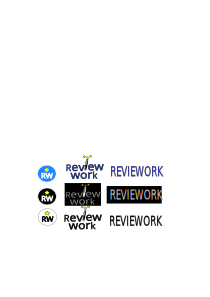

# 🌐 REVIEWORK
**Autor:** Sergio Domínguez  
**Curso:** DAW  

---

## 🧩 Introducción  

Esta plataforma está dedicada a la publicación de reseñas sobre establecimientos y empresas, basadas en experiencias laborales reales.  
Su objetivo es proporcionar a quienes buscan empleo, así como a quienes ofrecen oportunidades laborales, una visión clara y objetiva sobre el ambiente de trabajo, las condiciones salariales y la calidad de los equipos de trabajo.  

---

## 🎯 Objetivos  

- Desarrollar una web con buscador de empresas donde los usuarios puedan dejar reseñas.  
- Implementar un método de autenticación (por ejemplo, subida de nómina) para verificar que el usuario ha trabajado en la empresa.  
- Incorporar los datos salariales de forma automática a partir de la nómina subida.  

---

## 🧠 Descripción Detallada  

La plataforma ofrecerá un espacio donde las personas puedan compartir reseñas sobre las empresas en las que han trabajado, sin necesidad de crear una cuenta.  
El sistema validará la autenticidad de las reseñas mediante la **subida de documentos (nóminas u otros)** que verifiquen la experiencia laboral del usuario.  

Además, contará con un **mapa interactivo de Google Maps** para localizar fácilmente las empresas, visualizar su ubicación y acceder a las reseñas y valoraciones.  

---

## ⚙️ Requerimientos Técnicos  

### 🗺️ Integración con Google Maps  
- Al buscar una empresa, aparecerá su ubicación directamente en el mapa.  
- Sistema de búsqueda inspirado en la experiencia de plataformas como *Airbnb*.  

### 🔐 Autenticación mediante Documentos  
- Los usuarios podrán verificar su experiencia laboral subiendo una nómina u otro documento de prueba.  
- Los documentos serán validados antes de permitir la publicación de la reseña.  

### ⭐ Sistema de Reseñas  
- Publicación de reseñas sin registro obligatorio.  
- Valoración de empresas con estrellas y comentarios detallados.  

### 🧭 Interfaz Intuitiva  
- Diseño sencillo y limpio, fácil de usar.  
- Búsqueda avanzada con filtros por empresa, sector, ubicación, etc.  

### 🛡️ Seguridad y Privacidad  
- Protección de los datos personales (nóminas y archivos subidos).  
- Posibilidad de publicar reseñas **de forma anónima**.  

### 🧹 Moderación de Contenidos  
- Sistema de revisión previa antes de publicar reseñas.  
- Prevención de comentarios ofensivos o falsos.  

---

## 🧰 Funcionalidades Principales  

| Funcionalidad | Descripción |
|----------------|-------------|
| **Publicación de Reseñas** | Permite subir experiencias laborales y adjuntar nómina como verificación. |
| **Visualización de Empresas** | Búsqueda de empresas por nombre, sector o ubicación. |
| **Filtrado de Reseñas** | Filtros por tipo de empresa, salario o ambiente laboral. |
| **Valoraciones y Comentarios** | Escala de estrellas + comentarios adicionales. |

---

## 👥 Destinatarios y Público Objetivo  

- **Candidatos a empleo:** conocer condiciones laborales antes de postularse.  
- **Trabajadores actuales o pasados:** compartir experiencias de forma anónima o pública.  
- **Empresas:** conocer su reputación y mejorar su cultura laboral.  
- **Agencias y plataformas de empleo:** usar la información para asesorar candidatos.  

---

## 🎯 Clientes Potenciales  

- Personas en búsqueda activa de empleo.  
- Empresas de recursos humanos.  
- Instituciones educativas que preparan a estudiantes para el mundo laboral.  
- Empleadores interesados en mejorar su imagen y condiciones internas.  

---

## 🧱 Stack Tecnológico  

- **Frontend:** HTML5  
- **Backend:** JavaScript  
- **Repositorio:** [PI_Sergio_Dominguez](https://github.com/seergiod/PI_Sergio_Dominguez)  

---

## 🖼️ Logo  
```markdown

